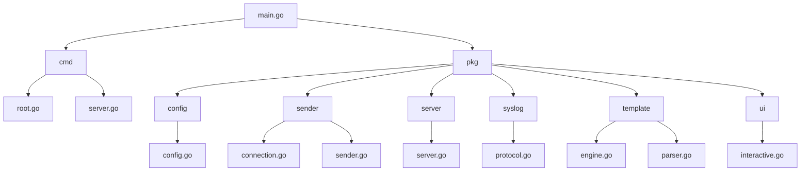
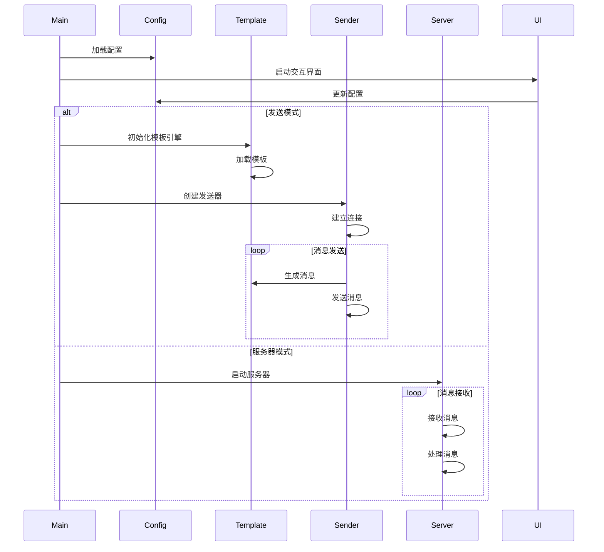
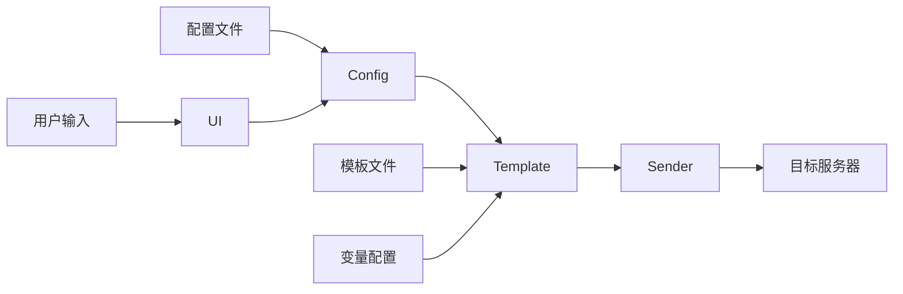

# 代码架构说明

## 项目结构

## 核心组件调用关系

## 组件职责

1. **Config（配置管理）**
   - 加载和验证配置文件
   - 提供默认配置
   - 支持配置更新

2. **Template（模板引擎）**
   - 模板解析和渲染
   - 变量替换处理
   - 支持自定义变量

3. **Sender（发送器）**
   - 管理网络连接
   - 控制发送速率
   - 处理重试和错误

4. **Server（服务器）**
   - 监听网络端口
   - 接收和处理消息
   - 支持TCP/UDP协议

5. **UI（交互界面）**
   - 提供命令行交互
   - 配置参数管理
   - 显示运行状态

## 数据流

