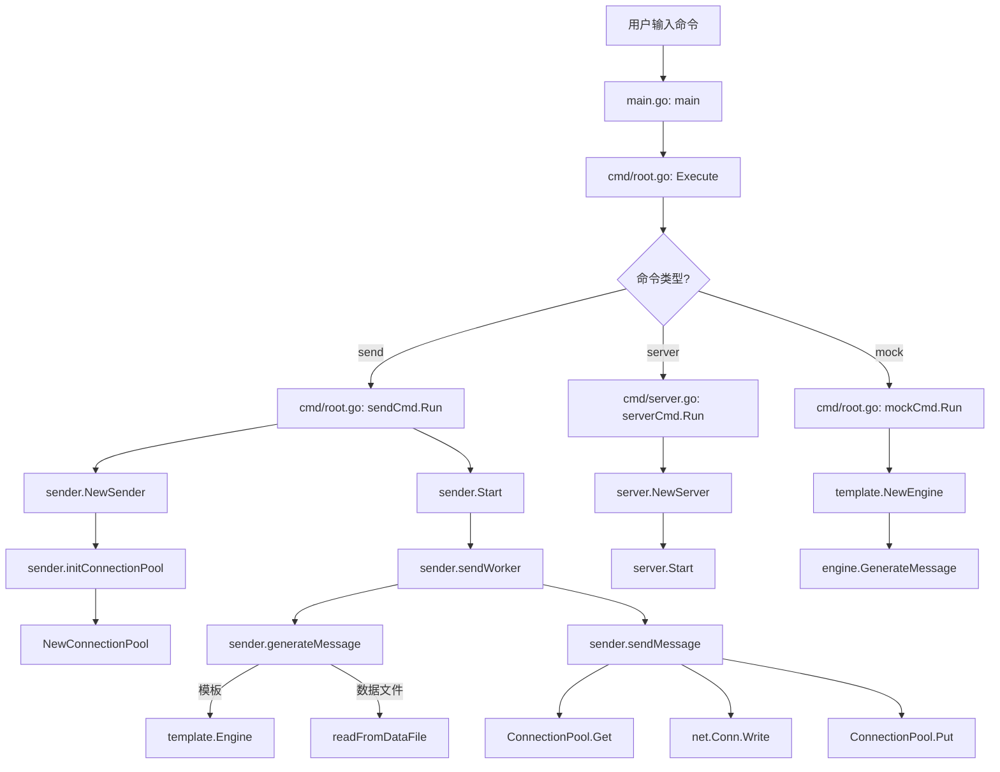

# 函数调用流程图

## 主要流程说明

### 1. 命令解析流程
- 程序从main.go入口开始
- 通过cobra框架解析命令行参数
- 根据命令类型分发到不同的处理函数

### 2. 发送命令流程(send)
- 创建Sender实例
- 初始化连接池
- 启动发送工作协程
- 生成消息（支持模板或文件）
- 通过连接池发送消息

### 3. 服务器命令流程(server)
- 创建Server实例
- 启动UDP和TCP监听

### 4. 模拟数据命令流程(mock)
- 创建模板引擎
- 生成模拟数据
- 输出到文件或标准输出